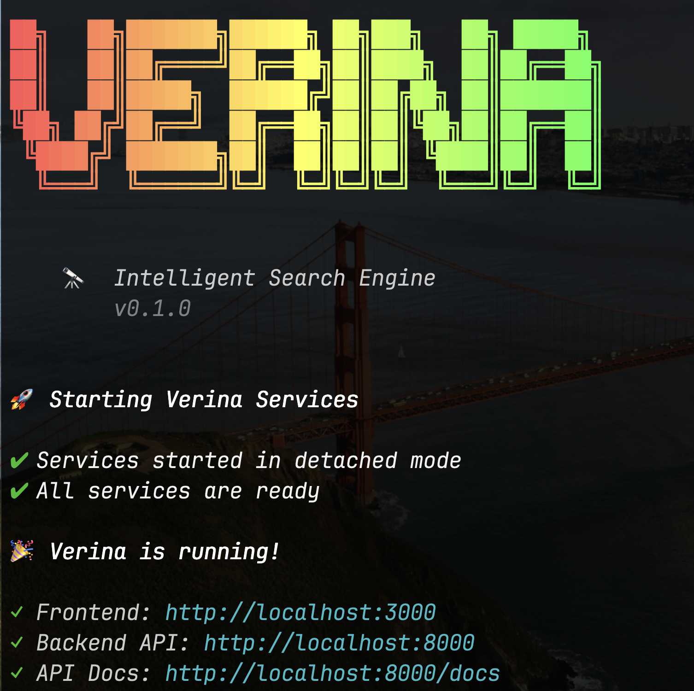

<div align="center">

<pre>
██╗   ██╗███████╗██████╗ ██╗███╗   ██╗ █████╗
██║   ██║██╔════╝██╔══██╗██║████╗  ██║██╔══██╗
██║   ██║█████╗  ██████╔╝██║██╔██╗ ██║███████║
╚██╗ ██╔╝██╔══╝  ██╔══██╗██║██║╚██╗██║██╔══██║
 ╚████╔╝ ███████╗██║  ██║██║██║ ╚████║██║  ██║
  ╚═══╝  ╚══════╝╚═╝  ╚═╝╚═╝╚═╝  ╚═══╝╚═╝  ╚═╝
</pre>


**Meet Verina! An intelligent search engine for you**

Quick answers? Search. Curious about something? Chat. Tough research? Agent.

[](LICENSE)
[](https://www.docker.com/)
[](https://x.com/YangLi_leo)

</div>

---

## 🎥 Fast Mode vs Deep Mode

<table>
  <tr>
    <td width="50%">
      <h3 align="center">⚡ Fast Mode</h3>
      <p align="center"><i>Quick answers in 5 seconds</i></p>
      
    </td>
    <td width="50%">
      <h3 align="center">🧠 Deep Mode</h3>
      <p align="center"><i>Extended thinking & multi-perspective analysis</i></p>
      
    </td>
  </tr>
</table>

### 🤖 Agent Mode: Long-Context Research with Visual Reports

<div align="center">

<p><i>Sustained 18-minute research session generating structured analysis and actionable recommendations</i></p>
</div>

---

## 📸 CLI Interface

<div align="center">

</div>

---

## Why Verina?

**Search → Read → Chat**
We seamlessly fuse search and chat UI. Search first, click sources to read, then continue chatting with human-in-the-loop interaction.

**Agent Mode for Deep Research**
For complex questions, activate autonomous analysis with efficient tools and external file system for optimized context management.

**Lightning Fast**
Powered by Gemini 2.5 Flash + Exa API for blazing search speed with exceptional quality.

**Open Source & Local**
Perfect alternative to ChatGPT and Perplexity. Build your own browser. BYOK with OpenRouter API (1M free requests/month).

**Easy CLI Setup**
Beginners can launch instantly with one command.

## Quick Start

### For Users

**Prerequisites:**
- Install [Docker Desktop](https://docs.docker.com/get-docker/) and **make sure it's running**
- Node.js 18+ installed

**1️⃣ Install**
```bash
npm install -g verina
```

**2️⃣ Configure API Keys**
```bash
verina init
```

You'll be prompted for [OpenRouter](https://openrouter.ai/keys) and [Exa](https://exa.ai/) API keys.

**3️⃣ Start**
```bash
verina
```

Your browser opens at **http://localhost:3000**. That's it!

> ⚠️ **First launch takes 5-10 minutes** to download Docker images. Subsequent starts take 10-20 seconds.

📖 See [CLI documentation](packages/cli/README.md) for more commands.

---

### For Developers

```bash
git clone https://github.com/YangLi-leo/Verina.git
cd Verina
cp config/.env.example config/.env.development
# Edit config/.env.development with your API keys
verina dev
```

Your browser opens at **http://localhost:3000** with hot reload enabled.

**Requirements**: Docker Desktop + [OpenRouter](https://openrouter.ai/keys) + [Exa](https://exa.ai/) keys

## Current Status

🚧 **Alpha Release**: The frontend optimization needs improvement and may contain bugs. Your feedback helps us improve!

**Known Limitations:**
- **No concurrent sessions**: Switching between search/chat sessions will automatically stop the current ongoing task. This prevents message mixing and ensures data consistency.
- To maintain multiple conversations simultaneously, please wait for the current task to complete before switching.

**Planned Features:**
- Multi-session support with independent concurrent execution
- Enhanced state management for better parallel processing

Please report any issues to [GitHub Issues](https://github.com/YangLi-leo/Verina/issues).

## Tech Stack

**Frontend**: Next.js 15, React 19, TypeScript
**Backend**: FastAPI, Exa API, OpenRouter
**Infrastructure**: Docker, local file storage

## License

Apache 2.0 - see [LICENSE](LICENSE) for details.

Copyright 2025 Li Yang

---

<div align="center">

**Built for better research experiences** 🔬

[Report Bug](https://github.com/YangLi-leo/Verina/issues) • [Request Feature](https://github.com/YangLi-leo/Verina/issues)

</div>
